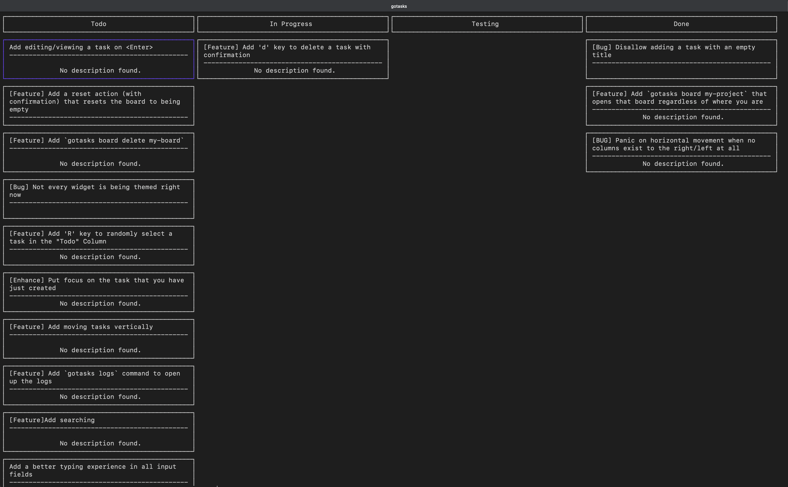

# GoTasks - A Kanban board in your terminal
Ever wanted an alternative to the todo.txt file in your project directory that isn't a full web app running in a browser that has hundreds of networking features that you don't want? This is what GoTasks is for!
It is a simple `gotasks` command that you run in the directory (or sub directory) of you project in your terminal and it immediately gives you a Kanban of all your tasks and progress.



## Installations
Binaries are provided in the Releases section. If your target computer isn't covered, you can always build from source.

## Usage
Just run `gotasks` in the directory of the project. The first time you open the program, the directory you are in saves a board at its location. On next times, opening `gotasks` in the same directory or any sub directory under it will open the same board for it.

While everything is documented in this README, you can do `?` anywhere while running GoTasks and you will see a help popup for every command and its key.

You can also run `gotasks help` to list all the commands

## Configuring the Board
Running `gotasks config`, will open up the config for all projects. Adding columns to the `columns` property on any project adds columns to that board. Keep in mind that the left-most and the right-most columns will always be considered the "backlog" and the "done" columns respectively for any board.

## Global Variables
- `EDITOR`: If set, determines the editor you want the command `gotasks config` to open the config with. By default, it opens with Vi
- `GOTASKS_THEME`: Could be "dark" or "light"
- `GOTASKS_DEBUG`: When set to true, it allows for logging debug messages that don't mean errors on `/path/for/config/gotasks/app.log`

## Movement
- `j | <Down>`: Moves down one task
- `k | <Up>`: Moves up one task
- `h | <Left>`: Moves to the previous column
- `l | <Right>`: Moves to the next column
- `n`: Scrolls the view one task down
- `p`: Scrolls the view one task up
- `g`: Selects the top most task in the current column
- `G`: Selects the bottom most task in the current column

## Actions
- `c`: Opens the popup for creating a new task. New tasks will appear on-top and in the left-most column
- `e`: On any task, opens the popup for editing/viewing the task
- `d`: Deletes a task with a confirmation toggle
- `]`: Move task to the next column
- `[`: Move task to the previous column
- `s | /`: Opens a search popup where you can do fuzzy search on the whole board. Search for an empty string to reset the filter

## Contributing
Pull requests are always welcomed and encouraged. Feel free to open an issue first to discuss what you would like to change.

## File Structure
```
.
├── .gitignore
├── LICENSE
├── README.md
├── assets
│   └── preview_screenshot.png
├── build.sh
├── cmd
│   ├── board
│   │   ├── open-board-by-name.go
│   │   └── root.go
│   ├── list-all-boards.go
│   ├── open-config.go
│   ├── open-logs.go
│   ├── root.go
│   └── version.go
├── go.mod
├── go.sum
├── internal
│   ├── domain
│   │   ├── task.go
│   │   └── user-config.go
│   ├── opt
│   │   └── safego.go
│   ├── ui
│   │   ├── app.go
│   │   ├── components
│   │   │   ├── columns-headers.go
│   │   │   ├── confirmation-popup.go
│   │   │   ├── create-task-popup.go
│   │   │   ├── search-dialog-popup.go
│   │   │   └── tasks-view.go
│   │   ├── custom-widgets
│   │   │   └── text-input.go
│   │   ├── events.go
│   │   ├── render.go
│   │   ├── theming.go
│   │   └── types
│   │       └── ui.go
│   ├── utils
│   │   ├── code-editing.go
│   │   ├── common.go
│   │   ├── keyboard-events.go
│   │   ├── logging.go
│   │   ├── process.go
│   │   ├── rendering.go
│   │   └── searching.go
│   └── vars
│       ├── colors.go
│       └── env.go
└── main.go
```

## License
This project is licensed under the [MIT License](https://choosealicense.com/licenses/mit/). See the [LICENSE](LICENSE) file for details.